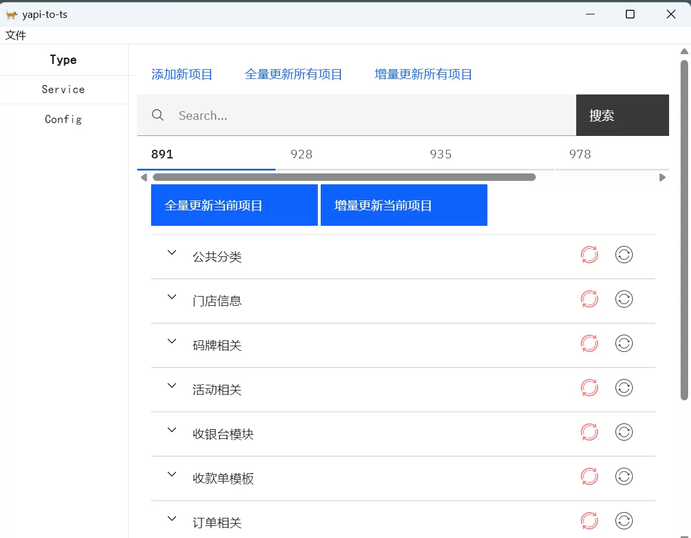
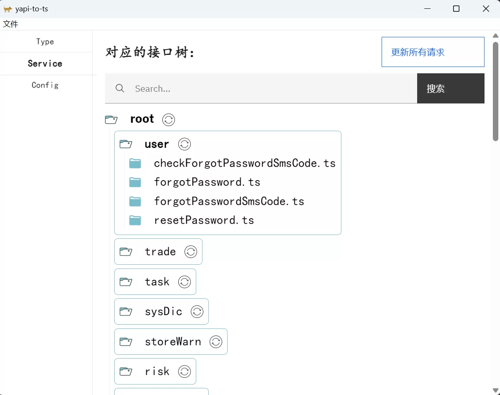
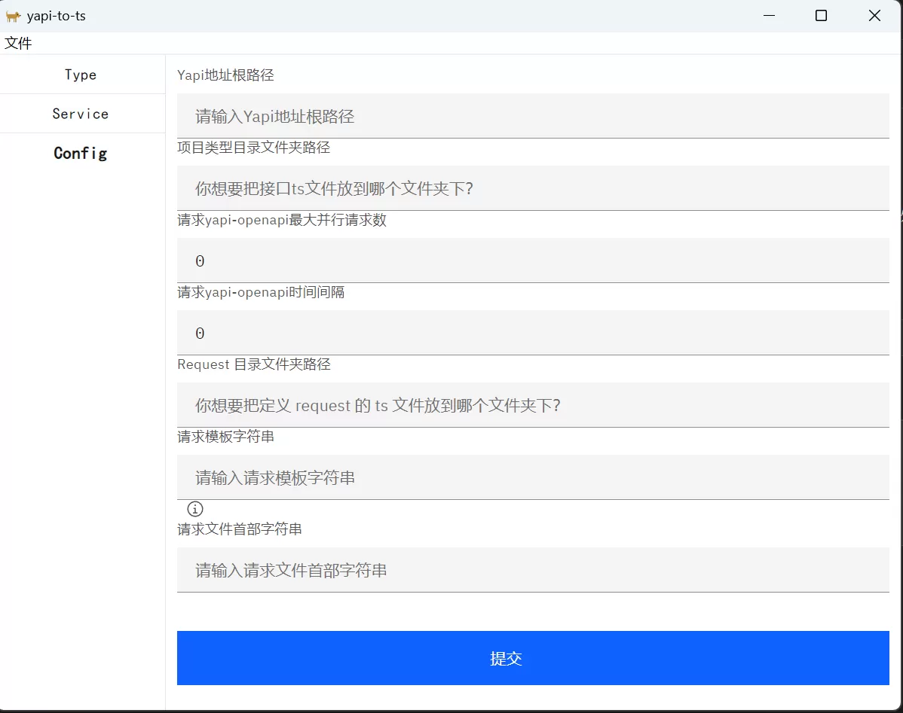

## yapi-to-typescript-app 

**易于使用**的通过 yapi 的 openapi 服务来批量生成 Typescript 接口代码与请求方法的桌面端应用。

## 特性

- 基于 tauri + svelte 搭建，支持 Windows , Mac , Linux.
- 支持配置 openapi 的并行请求数、请求间隔
- 支持 TS 接口的增量更新
- 支持为一个代码库配置多个 yapi 项目
- 支持以项目、类目、接口等维度来更新维护 TS 接口定义
- 支持根据 TS 定义自动生成请求方法。
- 支持配置请求方法的模板。
- 支持搜索并更新指定 TS 接口、类目、项目及依赖 TS 定义的请求方法。

## 预览

生成 TS 定义：


生成请求方法：


配置：


生成的 TS 定义：
```ts
// 服务商费率查询
export interface agentFeeInfoRequest {
    // 服务商编号
    agentCode: string
}

// 服务商费率查询
export interface agentFeeInfoResponse {
    // 状态码
    code: string
    // 无注释
    data: agentFeeInfoData
    // 描述
    msg: string
    // 响应时间
    timestamp: string
}
export interface agentFeeInfoData {
    // 服务商编号
    agentCode: string
    // 备注
    remark: string
    // 状态  0-正常    1-关闭
    status: string
    // 服务商分账成本费率：0.12
    subCostFee: string
}
```

生成的请求定义（以 umi-request 为例）：

```ts
import { request } from 'umi';
import { checkForgotPasswordSmsCodeRequest , checkForgotPasswordSmsCodeResponse } from "@/src/types/user/checkForgotPasswordSmsCode"
import { forgotPasswordRequest , forgotPasswordResponse } from "@/src/types/user/forgotPassword"
import { forgotPasswordSmsCodeRequest , forgotPasswordSmsCodeResponse } from "@/src/types/user/forgotPasswordSmsCode"
import { resetPasswordRequest , resetPasswordResponse } from "@/src/types/user/resetPassword"
// 忘记密码验证码校验
export const checkForgotPasswordSmsCode = (params: checkForgotPasswordSmsCodeRequest) => request<checkForgotPasswordSmsCodeResponse>('/api/usercheckForgotPasswordSmsCode' , { method: 'post' , data: params});
// 忘记密码修改
export const forgotPassword = (params: forgotPasswordRequest) => request<forgotPasswordResponse>('/api/userforgotPassword' , { method: 'post' , data: params});
// 忘记密码验证码发送
export const forgotPasswordSmsCode = (params: forgotPasswordSmsCodeRequest) => request<forgotPasswordSmsCodeResponse>('/api/userforgotPasswordSmsCode' , { method: 'post' , data: params});
// 用户密码重置
export const resetPassword = (params: resetPasswordRequest) => request<resetPasswordResponse>('/api/userresetPassword' , { method: 'post' , data: params});
```

模板为：`export const $1 = (params: $2) => request<$3>('/api/$4' , { method: 'post' , data: params});`
<p>$1: 请求名</p>
<p>$2: 请求类型</p>
<p>$3: 返回类型</p>
<p>$4: 接口地址</p>